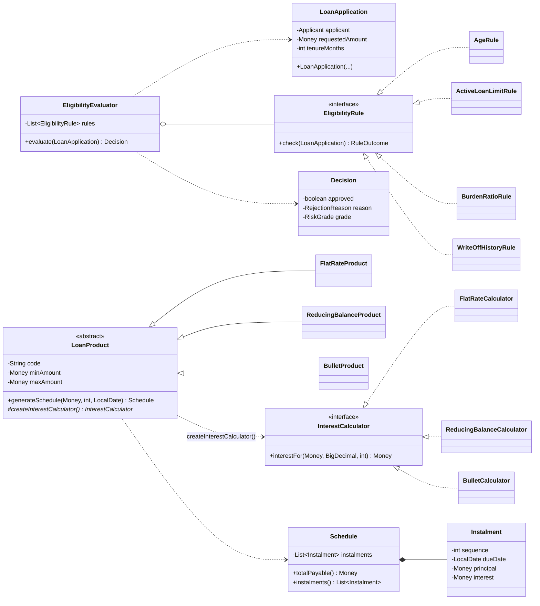
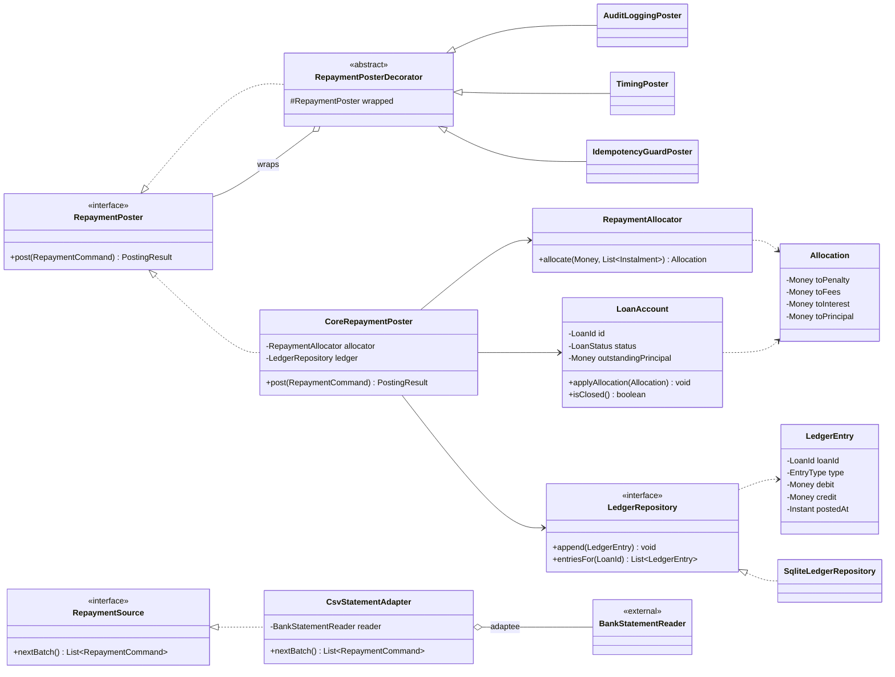
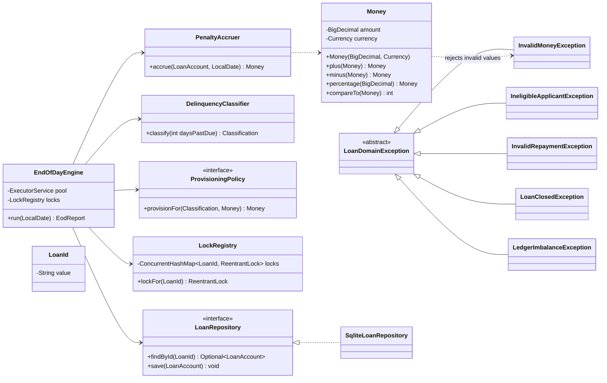
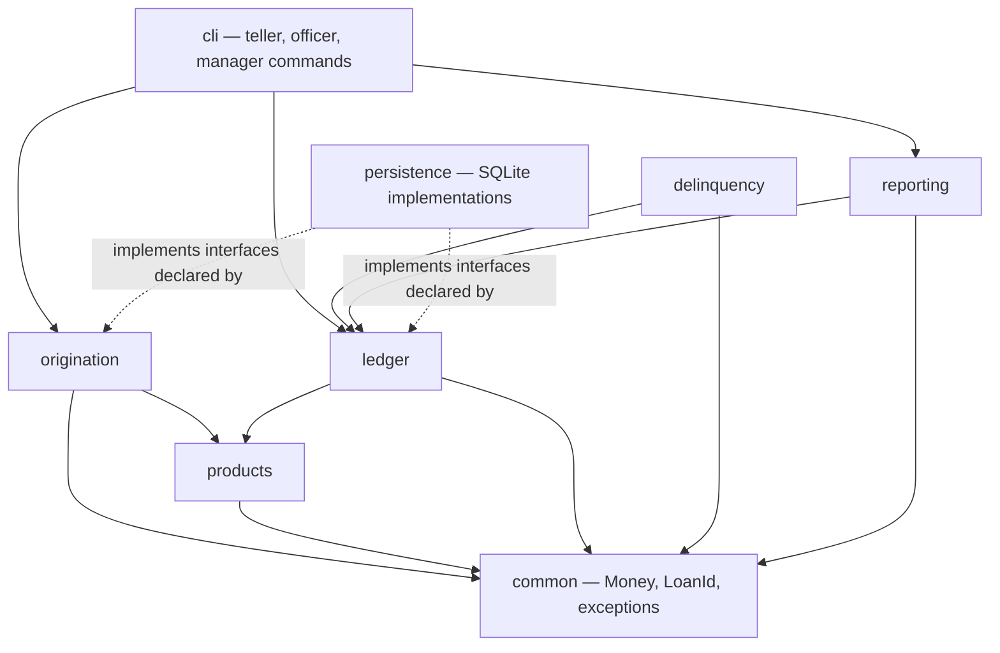

# Milestone 1 — SE423 Software Construction & Development

## MicroLend — Community Microfinance Loan Servicing & Delinquency Engine

**Team**

| Member | Reg. # | Primary modules | Pattern owned |
|---|---|---|---|
| Muhammad Ibrahim | 2023446 | `origination`, `delinquency` | Adapter |
| Hassan Khalid | 2023242 | `products`, `reporting` | Factory Method |
| Tughral Hussain | 2023532 | `ledger` | Decorator |

**Team Lead / Integrator (M1):** Tughral Hussain — role rotates each milestone.
**Repository:** https://github.com/tughral1/microlend
**Milestone:** M1 (Week 6) · **Weight:** 15% of the project grade

---

## 1. Problem Definition and Requirement-to-Minimum Mapping

### 1.1 The system

A community microfinance institution lends small amounts — typically Rs. 25,000 to Rs. 200,000 — to shopkeepers, tradespeople and smallholders who cannot access bank credit. The loans are short, repayment is frequent, and the institution's survival depends on knowing, every single day, exactly how much is owed, how much is overdue, and how much of the portfolio is at risk of never being recovered.

**MicroLend is the back-office engine that answers those questions.** It assesses loan applications against eligibility rules, generates repayment schedules, applies incoming repayments to the right obligations in the right order, maintains an audit-grade ledger, and runs a nightly process that ages overdue accounts, accrues penalties and classifies the portfolio by risk.

The system is deliberately a **back-office engine with a command-line interface**. There is no web front end, no network dependency and no third-party service. Every demonstration runs from a local database on a laptop.

### 1.2 Its users

| User | What they do with MicroLend |
|---|---|
| **Loan officer** | Enters an application; the system approves or rejects it with a stated reason, and produces the repayment schedule the customer signs |
| **Teller / cashier** | Posts repayments as customers pay; the system decides how each payment is applied and records it |
| **Branch manager** | Reads portfolio reports — how much is overdue, how much must be provisioned, how effective collection has been |
| **System (scheduled)** | Runs the end-of-day process: accrues penalties, ages accounts, re-classifies risk, writes off unrecoverable loans |

### 1.3 Why this problem is worth building software for

Three properties make this domain demanding in a way a CRUD application is not:

1. **Money must be exactly right.** A repayment schedule whose instalments do not sum to principal plus interest is not "approximately correct"; it is wrong, and the error compounds across a portfolio.
2. **Order of application matters.** The same Rs. 4,000 applied penalty-first versus principal-first produces different balances, different interest, and a different delinquency classification months later.
3. **The record must be trustworthy.** A ledger that can be edited is not a ledger. Corrections must be visible as corrections.

Those three properties are what give the system its invariants, and the invariants are what the design in Section 3 protects.

### 1.4 Scope boundary

**In scope for this project:** individual loans, three product types, fixed-rate lending in a single currency, repayment by cash at the branch or by bank statement import, penalty accrual, delinquency classification, provisioning, write-off, statements and portfolio reporting.

**Explicitly deferred** (recorded here so that scope cannot creep silently): group/joint-liability lending, guarantors and collateral registers, loan restructuring and rescheduling, multi-currency, savings products, interest on savings, mobile money integration, and any user interface beyond the CLI.

### 1.5 Mapping of each Section 3.1 minimum requirement to how it will be met

| # | Minimum requirement (guidelines §3.1) | How MicroLend meets it | Evidence at |
|---|---|---|---|
| 1 | **≥ 4 distinct functional modules** with real business logic, not a single-file CRUD demo | Five modules: `origination` (eligibility decisions), `products` (schedule generation), `ledger` (allocation waterfall and posting), `delinquency` (penalty accrual, ageing, provisioning), `reporting` (statements and portfolio metrics). Each owns a distinct **decision**, not a screen — see §2 | M2, M3 |
| 2 | **OO design demonstrating SOLID**, with written justification of where and why each principle was applied | §3 gives the class design with cohesion and coupling reasoning; §4 analyses all five principles, identifying where each is relevant, not relevant, or not yet observable | M1 (§3, §4) |
| 3 | **≥ 3 correctly implemented, justified patterns**, at least one creational plus one structural or behavioural | **Factory Method** (creational) in `products`, **Adapter** (structural) at the bank-statement import boundary, **Decorator** (structural) on the repayment-posting pipeline. Each with the alternative rejected — §5 | M1 plan, M2 implementation |
| 4 | **≥ 1 genuine concurrent or asynchronous operation** with a documented thread-safety strategy | The end-of-day engine processes the active portfolio across a fixed thread pool while tellers post repayments to the same accounts. Strategy in §3.6 | M2 |
| 5 | **Defensive programming and structured exception handling** across module boundaries | Validation in constructors and command factories so invalid objects cannot exist; a typed exception hierarchy rooted at `LoanDomainException`; `Money` rejects invalid values at construction — §3.5 | M2 |
| 6 | **Persistent data layer with a defined schema** | SQLite, seven tables with foreign keys and `CHECK` constraints that re-state the code's invariants at the storage layer — §3.7 | M2 |
| 7 | **TDD suite ≥ 60% of core business logic** with visible red-green-refactor history | Eligibility, schedule generation, allocation and classification are pure functions over `Money` and dates — ideal test-first targets. Commit convention `test(red):` → `feat(green):` → `refactor:`; squash-merge **disabled** in repository settings so the trail survives — §6.3 | Repository history, M2, M3 |
| 8 | **Hosted Git repository** with individually attributable contribution history | GitHub, public. Module ownership maps one-to-one onto directories, so `git log` per path is meaningful. `CODEOWNERS` routes each pull request to the module owner; no author merges their own work — §6 | Repository, all milestones |
| 9 | **CI pipeline** that builds and runs the test suite on push | GitHub Actions: compile, JUnit, JaCoCo coverage report, Checkstyle gate. No secrets, no network dependency — §6.4 | M2 |

---

## 2. Module Breakdown and Ownership

Five modules — one above the minimum, so that if effort runs short, `reporting` can be reduced without dropping below four.

| # | Module | Scope in one line | Primary owner |
|---|---|---|---|
| 1 | **`origination`** | Decides whether an application is approved, on what terms, and with what stated reason if rejected | **Muhammad Ibrahim** |
| 2 | **`products`** | Holds the loan product catalogue and generates the repayment schedule for an approved loan | **Hassan Khalid** |
| 3 | **`ledger`** | Applies incoming repayments through the allocation waterfall and records every movement in an append-only ledger | **Tughral Hussain** |
| 4 | **`delinquency`** | Runs the end-of-day process: accrues penalties, computes days past due, classifies and provisions accounts, writes off | **Muhammad Ibrahim** |
| 5 | **`reporting`** | Produces customer statements, portfolio risk reports and CSV exports | **Hassan Khalid** |

### 2.1 The business rules each module owns

These are frozen at M1 in the **Business Rules Register** (`docs/business-rules.md`) so that the requirements the SQA side traces against do not move underneath it.

**`origination`** — An applicant must be 18 or older at disbursement and no older than 65 at maturity; may hold at most 2 active loans; total monthly instalment burden must not exceed 40% of declared monthly income; must have no prior write-off; the requested amount and tenure must lie within the product's bands. A failing application yields a **typed rejection reason**, not a boolean. Risk grade A/B/C adjusts the rate by a fixed spread and caps the approved amount.

**`products`** — Three products: **flat-rate** (interest on the original principal throughout), **reducing-balance** (interest on the outstanding balance, equal instalments), and **bullet** (interest monthly, principal at maturity). Instalment dates follow the same day-of-month as disbursement, clamped for short months. An optional grace period defers the first instalment but still accrues interest. All rounding residue is absorbed into the final instalment, so the instalments sum **exactly** to principal plus total interest.

**`ledger`** — Payments are applied in strict order: **penalty → fees → interest → principal**, oldest unpaid instalment first. Partial payments are allowed and applied as far as they reach. An overpayment becomes an advance credit, unless it clears the loan, in which case early settlement applies a rebate of unearned interest for reducing-balance loans and no rebate for flat-rate loans. **A posted ledger entry is immutable**; a mistake is corrected only by a compensating reversal entry.

**`delinquency`** — For a given business date: accrue a penalty of 0.05% per day on overdue principal, capped at 10% of the overdue amount; compute days past due; place the account in a bucket (0 / 1–30 / 31–60 / 61–90 / 90+) mapping to a classification (Standard / Watch / Substandard / Doubtful / Loss); apply the matching provision percentage; write the loan off automatically past 180 days overdue.

**`reporting`** — Customer statement for a date range; portfolio reports (portfolio at risk over 30 days, provision coverage, collection efficiency); CSV export; an alert event raised whenever an account's classification changes.

### 2.2 Why ownership is split this way

Each owner holds a module whose **invariant they can state in a single sentence**, which is what makes individual Q&A defensible:

- **Muhammad Ibrahim** — *"No loan may exist that the eligibility rules would not have approved."*
- **Hassan Khalid** — *"The instalments of a schedule sum exactly to principal plus total interest."*
- **Tughral Hussain** — *"The ledger always balances, and nothing in it is ever altered."*

Ibrahim additionally owns the concurrent end-of-day engine, which depends on Tughral's ledger; that dependency is deliberate, because it forces the two of them to agree an interface rather than reach into each other's internals.

**SE431 deliverable ownership rotates** so that every member leads each kind of quality artifact at least once:

| Milestone | SQAP & risk register | Quality requirements & RTM | Inspection, static analysis & white-box |
|---|---|---|---|
| M1 | Muhammad Ibrahim | Hassan Khalid | Tughral Hussain |
| M2 | Hassan Khalid | Tughral Hussain | Muhammad Ibrahim |
| M3 | Tughral Hussain | Muhammad Ibrahim | Hassan Khalid |

---

## 3. Object-Oriented Design

### 3.1 Design intent

The design is organised around one idea: **the objects that hold money-related state are responsible for defending their own correctness.** Validation is not performed by services on passive data structures; it happens inside the objects, at construction and at every state transition, so that an invalid object cannot exist for other code to defend against.

Everything else follows from that. Services are thin and stateless. Data crosses module boundaries as immutable value objects. Persistence is reached only through interfaces the domain itself declares.

### 3.2 Class diagram

The class model is shown in three views, one per area of the system. Shared kernel types (`Money`, `LoanId`, the exception hierarchy) appear where they are used.

**View 1 — Origination and Products: deciding whether to lend, and on what schedule**



*Note the two extension points: a new eligibility rule is a new `EligibilityRule`; a new loan product is a new `LoanProduct` subclass with its calculator. Neither requires editing a tested class.*

**View 2 — Ledger: applying money, with the posting pipeline and the import boundary**



*The Decorator chain and the Adapter boundary are both visible here: decorators are each IS-A and HAS-A `RepaymentPoster`, and `CsvStatementAdapter` holds the foreign reader by composition rather than inheriting it.*

**View 3 — Delinquency, the shared kernel, and the persistence boundary**



*`EndOfDayEngine` holds only the interfaces it needs — it cannot export a report or read the full ledger, because those methods are not on the types it is given. The exception hierarchy is rooted at `LoanDomainException`, so nothing outside a module ever catches a storage-layer exception.*

### 3.3 Component view and allowed dependencies



**The dependency rule:** arrows point inward, toward `common`, and never outward from a domain module to persistence or the CLI. `persistence` depends on the domain, not the reverse — the dashed arrows are implementations of interfaces the domain declares. There are **no cycles** between modules, and this is enforced as a build-time check rather than left as an intention.

### 3.4 Cohesion and coupling reasoning

**Cohesion — each module is functionally cohesive, not grouped by convenience.**

The test applied to every module was: *do these operations exist to serve one job, or do they merely share a noun?* A class holding `assessEligibility()`, `saveToDatabase()`, `renderStatementPdf()` and `emailCustomer()` would be only **logically cohesive** — grouped because each mentions a loan — and would answer to four different stakeholders. That class does not exist here. Instead:

| Module | Its single job | What was deliberately kept out |
|---|---|---|
| `origination` | Decide approval and terms | Schedule arithmetic (that is `products`), persistence (that is an injected repository) |
| `products` | Turn an approved amount and tenure into a schedule | Deciding *whether* to lend, and anything about repayment |
| `ledger` | Apply money to obligations and record the movement | Deciding penalties or classification (that is `delinquency`), formatting output |
| `delinquency` | Age, penalise, classify and provision | Writing ledger lines itself — it asks `ledger` to do that |
| `reporting` | Present what has already happened | Any calculation that changes state |

Within modules the same test is applied to classes. `EligibilityEvaluator` holds no rules of its own; each rule is a separate `EligibilityRule` implementation, so adding "must not be a staff member's relative" adds a class rather than an `if`. `RepaymentAllocator` computes an `Allocation` and does not write it; `CoreRepaymentPoster` writes it and does not compute it.

**Coupling — loose, and in one direction.**

1. **No module constructs another module's dependencies.** Business classes never execute `new SqliteLoanRepository(...)`. Repositories arrive through constructors, so `ledger` depends on the `LedgerRepository` *interface it declares itself*, and the SQLite implementation depends inward on that interface. The effect is concrete: the posting logic can be tested with an in-memory fake, with no database on the machine, and swapping SQLite for PostgreSQL changes one class in `persistence` and nothing in any domain module.
2. **Data crosses boundaries as immutable value objects.** `Money`, `Instalment`, `LedgerEntry` and `Allocation` have no setters. A caller cannot mutate another module's state by holding a reference to something it was given, and no module needs defensive copying on receipt.
3. **No internal collection is ever returned.** `Schedule.instalments()` returns an unmodifiable view. Returning the live list would let a caller bypass every rule in `Schedule`, and would freeze the choice of `List` as a public API that could never be changed to a `Map` for lookup by due date.
4. **Content coupling is impossible by construction.** No module exposes mutable fields; all state is private and changed only through methods that enforce the invariant.
5. **The one accepted dependency with weight** is `delinquency → ledger`, because penalty accrual must write ledger entries. It is deliberately **interface-only**: the end-of-day engine holds a `LedgerWriter`, not the posting implementation, and cannot read statements or export CSV through it.

**Where coupling is highest, and why that is acceptable:** `ledger` is the most depended-upon domain module (`delinquency` and `reporting` both need it). This is *afferent* coupling — many things depend on it — which is appropriate for a stable module whose contract is the smallest and least likely to change in the system. The risk this creates is recorded as **R1** in the risk register, and its mitigation is the golden-schedule test suite written before the implementation.

### 3.5 Defensive programming and exception design

**Invalid objects cannot be constructed.**

```java
public final class Money implements Comparable<Money> {
    private final BigDecimal amount;

    public Money(BigDecimal amount, Currency currency) {
        if (amount == null)           throw new IllegalArgumentException("amount is required");
        if (amount.scale() > 2)       throw new InvalidMoneyException("scale exceeds 2: " + amount);
        if (amount.signum() < 0)      throw new InvalidMoneyException("negative amount: " + amount);
        this.amount = amount.setScale(2, RoundingMode.HALF_EVEN);
        this.currency = Objects.requireNonNull(currency, "currency is required");
    }
}
```

Because `Money` cannot hold a negative or over-scaled value, no downstream code tests for one. The same applies to `LoanApplication` (validated in its constructor) and `RepaymentCommand` (validated in its factory). This is the difference between defending against bad input at one boundary and scattering `if (amount < 0)` through five modules.

**A typed exception hierarchy, carrying the reason.**

```
LoanDomainException  (abstract — the module boundary type)
├── IneligibleApplicantException   (carries the failing RuleOutcome)
├── InvalidRepaymentException      (carries the offending value and its source)
├── LoanClosedException            (carries loan id and closure date)
├── LedgerImbalanceException       (carries the computed debit and credit totals)
└── InvalidMoneyException
```

Rules: no `catch (Exception e)`, and no empty catch blocks — both are rejected by the static-analysis configuration. Exceptions crossing a module boundary are always `LoanDomainException` subtypes, so a caller never catches a JDBC exception; the repository translates storage failures into domain terms. Each exception carries the data needed to explain the failure, because `throw new RuntimeException("invalid")` tells an operator nothing.

### 3.6 The concurrent operation and its thread-safety strategy

**What runs concurrently.** The end-of-day engine processes the active portfolio across `Executors.newFixedThreadPool(4)`, one task per loan account, **while teller threads are still posting repayments to the same accounts**. This is not contrived: in a real branch, the nightly batch and late counter transactions overlap, and the demo harness runs both at once.

**The three races it must prevent:**

1. **Lost update.** A teller reads an outstanding balance of 10,000; the end-of-day task reads 10,000; both write back. One movement vanishes and the ledger stops balancing.
2. **Double penalty accrual.** If the engine runs twice for the same business date — a retry after failure, or two pool threads taking the same account — penalty is charged twice, inventing money.
3. **Torn read.** A portfolio report sums balances mid-update and reports a total that was never true at any instant.

**The strategy:**

| Measure | What it prevents |
|---|---|
| **Immutability at the core** — `Money`, `LedgerEntry`, `Instalment` have no mutable state | Nothing shared can be changed under another thread |
| **Per-account striped locks** — `ConcurrentHashMap<LoanId, ReentrantLock>`; all balance-changing work happens under that account's lock, never held across I/O | Lost updates, while leaving unrelated accounts fully parallel |
| **Ascending `LoanId` lock ordering** for any operation touching two accounts | Deadlock, by a stated and inspectable rule |
| **Unique `(loan_id, business_date)`** in `delinquency_snapshot` as an idempotency key | Double accrual — the second attempt is rejected by the schema even if locking fails |
| **Append-only ledger**, with an invariant test asserting Σ debits = Σ credits after every run | Silent imbalance under any interleaving |
| **Deterministic tests** driven by `CountDownLatch`, never `Thread.sleep` | Flaky CI, which is what causes teams to start ignoring red builds |

This also supplies the two deliberately injected failure scenarios the M3 rubric asks for: a repository that throws mid-posting must leave the ledger balanced, and an end-of-day task that dies must not block the pool or leave a half-applied accrual.

### 3.7 Persistent data layer

SQLite, seven tables. The schema **re-states the code's invariants** so that a corrupt write fails at two independent levels:

| Table | Holds | Constraints that matter |
|---|---|---|
| `customer` | Applicant identity, income, write-off history | — |
| `loan_product` | Catalogue: code, rate, amount band, tenure band | `CHECK (min_amount <= max_amount)` |
| `loan` | Account state: principal, status, grade, dates | FK to customer and product; `CHECK (outstanding >= 0)` |
| `instalment` | Generated schedule lines | FK to loan; `UNIQUE (loan_id, sequence)` |
| `ledger_entry` | Every money movement | FK to loan; `CHECK (debit >= 0 AND credit >= 0)`; **no `UPDATE` statement exists anywhere in the codebase** |
| `payment` | Received payments and their source | `UNIQUE (bank_reference)` — the idempotency guard |
| `delinquency_snapshot` | End-of-day result per loan per date | **`UNIQUE (loan_id, business_date)`** — prevents double accrual |

Monetary columns are stored as `INTEGER` minor units (paisa) rather than `REAL`, for the same reason `double` is banned in the code.

---

## 4. SOLID Application Plan

The rubric requires all five principles to be analysed, each marked **relevant**, **not relevant**, or **not yet observable**, with non-applicability justified. Three are demonstrated through concrete design decisions below.

### 4.1 Single Responsibility Principle — **relevant, demonstrated**

**The test applied:** who can demand a change to this class? If two different stakeholders can, it has two reasons to change.

The design decision this produced: an early sketch had one `LoanService` holding eligibility checks, schedule generation, repayment posting and statement rendering. Four actors could demand changes to it — the credit committee (eligibility), the finance department (rates and schedules), the branch operation (how payments are applied) and the marketing/communications side (statement layout). It was split into `EligibilityEvaluator`, `LoanProduct`/`ScheduleGenerator`, `RepaymentAllocator` and `StatementRenderer`.

**The concrete consequence:** a change to the penalty rate touches `delinquency` alone; a change to statement layout touches `reporting` alone. Neither forces re-testing of the repayment waterfall. Had they stayed together, a statement-formatting change would require re-certifying money-handling code.

`LoanAccount` holds state and enforces its own invariants, and does nothing else — it neither computes schedules nor renders itself.

### 4.2 Open–Closed Principle — **relevant, demonstrated**

**The design decision:** adding a fourth loan product must not require editing any tested class.

`LoanProduct` defines the stable `generateSchedule()` workflow and declares an abstract `createInterestCalculator()`. A new product is a new subclass plus a new calculator — two new files. `generateSchedule()` is never reopened, so the three existing products' tests cannot be broken by the arrival of a fourth.

The same shape appears in `origination`: eligibility is a list of `EligibilityRule` objects, so a new rule is a new class and a registration line, not an edit to `EligibilityEvaluator`.

**What was rejected:** a `switch (productType)` inside schedule generation. It would place every product's arithmetic in one method that must be reopened — and re-tested in full — for every new product, with the risk that a mistake in the new branch changes what existing borrowers are charged.

### 4.3 Liskov Substitution Principle — **relevant, demonstrated**

**The design decision, stated as something deliberately *not* done:** the institution offers interest-free hardship loans. The tempting modelling is `HardshipLoan extends ReducingBalanceProduct` with `createInterestCalculator()` overridden to throw `UnsupportedOperationException`, since there is no interest to calculate.

That is rejected. It refuses an operation the supertype promises, so a `HardshipLoan` cannot stand in for a `LoanProduct`, and every caller would need `instanceof` to avoid the exception. Instead, hardship lending is a `ZeroInterestCalculator` that honours the contract and returns `Money.ZERO`. Substitution holds, and no caller changes.

**The contract every `InterestCalculator` honours:** same preconditions (any non-negative principal, any tenure within the product band); returns a non-negative `Money`, never null; a schedule always has exactly `tenureMonths` instalments. These are stated in the interface's Javadoc and asserted in a **shared contract test** that every implementation must pass — so LSP is checked by the build rather than by good intentions.

### 4.4 Interface Segregation Principle — **relevant, demonstrated**

**The design decision:** the persistence boundary is not one fat `LoanDao`.

Separate role interfaces: `ScheduleProvider` (read a schedule), `LedgerWriter` (append an entry), `LedgerReader` (query entries), `RepaymentPoster` (post a repayment), `ReportExporter` (write CSV).

**The concrete consequence:** the end-of-day engine receives `ScheduleProvider` and `LedgerWriter` only. It is therefore *incapable* of exporting a CSV or reading the full ledger — not by policy, but because those methods are not on the interfaces it holds. A fat interface would have made the engine's test double implement export methods it never calls, and every one of those stubs would be a latent failure waiting to be invoked.

### 4.5 Dependency Inversion Principle — **relevant, demonstrated**

**The design decision:** the domain declares the interfaces it needs; persistence implements them.

`LoanRepository` and `LedgerRepository` are declared **inside the domain modules**, not in the persistence package. `SqliteLoanRepository` implements them and is injected at the composition root — the one place in the application that is allowed to call `new` on infrastructure.

**The concrete consequence:** no business class imports `java.sql`. Unit tests inject in-memory fakes and run with no database present. A ledger-posting test runs in milliseconds and cannot fail because of a locked file or a missing driver.

**What was rejected:** `new SqliteLoanRepository(connection)` inside `RepaymentPoster`. That would make the posting logic untestable without a real database, push a JDBC concern into business code, and make a storage change a business-code change.

### 4.6 Summary and honest limits

| Principle | Status at M1 | Where it is demonstrated |
|---|---|---|
| **SRP** | Relevant, demonstrated | Splitting of `LoanService` into evaluator, generator, allocator, renderer — §4.1 |
| **OCP** | Relevant, demonstrated | `LoanProduct` hierarchy and the `EligibilityRule` list — §4.2 |
| **LSP** | Relevant, demonstrated | Hardship lending modelled as a zero calculator, plus the shared contract test — §4.3 |
| **ISP** | Relevant, demonstrated | Role interfaces at the persistence and posting boundary — §4.4 |
| **DIP** | Relevant, demonstrated | Domain-declared repository interfaces, injected implementations — §4.5 |

**Not yet observable at M1.** All five are present in the design, but three can only be *evidenced* once code exists: LSP's contract test must run against three real calculators (M2); ISP's benefit shows when a test double is written for each role interface (M2); DIP's payoff is visible when the in-memory fakes make the test suite run without a database (M2). M1 commits to the structure; M2 produces the evidence.

**Where a principle is weaker, stated honestly.** SRP at the *module* level is clean, but `RepaymentAllocator.post()` is a single method with roughly eleven branches, which is the most complex method in the system. It is kept as one method deliberately — splitting the waterfall across classes would scatter a rule that must be read in order — and it is the primary subject of the Fagan inspection and the basis-path test design on the SQA side. Complexity that is acknowledged, inspected and fully covered is a different proposition from complexity that is hidden.

---

## 5. Design Pattern Selection and Justification

Three patterns, chosen by the rule that the construction problem comes first and the pattern name second. One creational and two structural, satisfying the "at least one creational plus at least one structural or behavioural" requirement.

### 5.1 Factory Method — `LoanProduct` as Creator (creational)

**Owner: Hassan Khalid**

**The construction problem.** `generateSchedule()` is a stable workflow: validate the tenure, build the due-date series, compute each instalment's interest, absorb the rounding residue into the final instalment, assemble the schedule. Exactly **one** step varies — which interest calculation applies. If the workflow writes `new ReducingBalanceCalculator()`, the schedule module becomes coupled to concrete classes through the `new` keyword, and must be reopened for every new product.

**The structure.** `LoanProduct` is the **Creator** and holds the stable workflow. `createInterestCalculator()` is the **factory method**, declared abstract by the Creator and overridden by `FlatRateProduct`, `ReducingBalanceProduct` and `BulletProduct` — the **ConcreteCreators**. `InterestCalculator` is the **Product** abstraction, and the three calculators are **ConcreteProducts**. The creator subtype determines what is created; the workflow never names a concrete class.

```java
public abstract class LoanProduct {
    public final Schedule generateSchedule(Money principal, int tenureMonths, LocalDate start) {
        InterestCalculator calculator = createInterestCalculator();   // ← the factory method
        // ... stable workflow: dates, per-instalment interest, rounding residue, assembly
    }
    protected abstract InterestCalculator createInterestCalculator();
}
```

**Alternative rejected: Simple Factory.** A `ScheduleFactory.create(type)` holding a `switch` was the obvious first design. It is rejected because the creation decision stays centralised in one place that must be edited for every new product — it *moves* the conditional ladder rather than removing it. A method that returns a new object is not automatically the GoF Factory Method; the distinguishing property is that the **creator subtype**, not a parameter, decides what gets created.

**Also rejected: Abstract Factory**, because there is no product *family* here — only one axis of variation, so a second factory layer is indirection without a second dimension. **Also rejected: Singleton** for a shared product registry, because it hides dependencies, introduces global mutable state and leaks state between tests; constructor injection already gives one shared instance without the coupling.

### 5.2 Adapter — `CsvStatementAdapter` (structural)

**Owner: Muhammad Ibrahim**

**The construction problem.** Repayments also arrive as bank statement files, and every bank's format differs: column order, date format, and amount convention — several report amounts in **minor units** (paisa) as integers. Neither contract is wrong; they were designed independently. The servicing core must keep thinking in `Money` and `LocalDate`.

**The structure.** The **Client** is the repayment-posting workflow. The **Target** is `RepaymentSource`, the interface our application already understands. The **Adaptee** is each bank's statement reader. The **Adapter** — `HblStatementAdapter`, `McbStatementAdapter` — converts `254900` into `Money(2549.00)` and `04102026` into a `LocalDate`, and translates the reader's parse failures into `InvalidRepaymentException`. It is an **Object Adapter**: it *has-a* reader rather than inheriting one.

**Alternative rejected: Facade.** The distinction is intent: an Adapter protects clients from an **interface mismatch**; a Facade protects clients from **excessive subsystem knowledge**. At the import boundary there is no complicated subsystem to simplify — there is exactly one foreign contract that does not fit ours. That is mismatch, not complexity.

**Also rejected: changing the core to speak the bank's format.** That moves the dependency in the wrong direction, spreading vendor vocabulary — minor units, their date format, their sign convention — through business logic, which is precisely the coupling the Adapter exists to contain at one boundary.

### 5.3 Decorator — the `RepaymentPoster` pipeline (structural)

**Owner: Tughral Hussain**

**The construction problem.** Posting a repayment must sometimes also (a) write an audit journal line naming the operator, (b) record elapsed time for the GQM measurement programme, and (c) guard against posting the same bank reference twice. **Which of these are needed differs per call path, and they combine:**

| Call path | Audit | Timing | Idempotency |
|---|---|---|---|
| Teller CLI | ✔ | ✔ | — |
| CSV bulk import | one per file | ✔ | ✔ |
| End-of-day internal adjustment | — | ✔ | — |
| Unit tests | — | — | — |

**The structure.** `RepaymentPoster` is the **Component**; `CoreRepaymentPoster` is the concrete component holding the real allocation call; `RepaymentPosterDecorator` both **IS-A** `RepaymentPoster` and **HAS-A** `RepaymentPoster`. `AuditLoggingPoster`, `TimingPoster` and `IdempotencyGuardPoster` each add one focused behaviour and then delegate to `wrapped.post(c)`.

**Composition order is deliberate and documented:** the idempotency guard wraps outermost, so a duplicate is rejected before anything is journalled or timed. Order matters in a Decorator chain, and stating why is part of the design.

```java
RepaymentPoster tellerPoster =
    new AuditLoggingPoster(
        new TimingPoster(
            new CoreRepaymentPoster(allocator, ledgerRepository)));
```

**Alternative rejected: inheritance combinations.** `AuditingPoster`, `TimingPoster`, `AuditingTimingPoster`, `AuditingIdempotentPoster`… — eight classes for three optional behaviours, and sixteen the day a retry behaviour is added. This is the classic subclass explosion, and the combinations cannot be chosen at runtime per call path.

**Also rejected: Proxy.** The two have nearly the same structure and are separated by intent: a Decorator primarily **extends behaviour**; a Proxy primarily **controls access**. Here nothing is being gated, protected or stood in for remotely — optional responsibilities are being layered, and they must stack. That is Decorator's pressure, not Proxy's.

### 5.4 Patterns considered and deliberately not used at M1

| Pattern | Why not now |
|---|---|
| **Facade** — `RepaymentFacade.postRepayment()` | A genuine candidate: three clients need the same five-step workflow. Held as a possible fourth pattern at M2. If adopted, it must **coordinate and not absorb** — the allocation rules stay in `RepaymentAllocator`, or it becomes a god class |
| **Strategy** — `ProvisioningPolicy` | Valid, and likely at M2 for swapping provisioning percentages when regulations change. Not claimed at M1, and `InterestCalculator` will **not** be presented as a Strategy, because it is the Product of the Factory Method above; claiming both patterns for the same objects would be incoherent |
| **State** — loan lifecycle; **Observer** — classification alerts | Both fit the domain, and both are deferred to M2 rather than adopted on vocabulary the team cannot yet defend in depth |

A pattern is only included where it solves a problem that existed in the design *before* the pattern was named. The three above each do.

---

## 6. Repository and Documentation Setup

**Repository:** https://github.com/tughral1/microlend (public)
**Collaborators:** `tughral1`, `mIBRAHIM707`, `Hassan242-kk`

### 6.1 Branching strategy

Three tiers:

| Branch | Purpose | Rules |
|---|---|---|
| `main` | Milestone baselines only | Protected. No direct pushes. Changes arrive solely by reviewed pull request |
| `develop` | Integration branch, the current working state | Receives pull requests from feature branches |
| `feature/<module>-<short-name>` | One unit of work, owned by one member | Branched from `develop`, merged back by pull request |

### 6.2 Quality gates (configured, not aspirational)

A GitHub **ruleset** is active on `main`:

- Direct pushes are **blocked** — every change requires a pull request
- **One approving review** required, from someone other than the author
- Stale approvals are **dismissed** when new commits are pushed
- **Last-push approval** required, so code cannot be slipped in after approval
- All review conversations must be **resolved** before merge
- Branch deletion and force-pushes are blocked
- Only the repository owner may bypass, and every bypass is logged by GitHub

`CODEOWNERS` routes each pull request automatically to the owner of the module it touches. Shared code — `Money`, the exception hierarchy, the Checkstyle configuration — requires all three members.

### 6.3 Preserving the TDD trail

**Squash-merge and rebase-merge are disabled in repository settings; merge commits are the only permitted method.** This is deliberate: squashing collapses a red-green-refactor sequence into a single commit, and the evidence cannot be reconstructed afterwards.

Commit convention:

```
test(red):     instalment rounding residue lands on the final instalment
feat(green):   absorb rounding residue in ScheduleGenerator
refactor:      extract RoundingPolicy from ScheduleGenerator
```

The pull-request template requires the author to name the red, green and refactor commit hashes for the change.

### 6.4 Baselines and CI

Milestone submissions are tagged on `main`: `m1-baseline`, `m2-baseline`, `m3-baseline`. A tag is created only at submission, so it points at exactly the state that was assessed.

The CI pipeline (GitHub Actions) runs on every push: compile → JUnit → JaCoCo coverage report → Checkstyle gate. It requires no secrets and no network access.

### 6.5 Coding standards

`config/checkstyle.xml` is the project coding standard, and it enforces **constraint C-01: money is never a binary floating-point type.** `double` and `float` are rejected by the build, and a second rule catches stray decimal literals such as `0.05`. All monetary values use `BigDecimal` inside `Money` with an explicit `RoundingMode`. `0.1 + 0.2 != 0.3` in IEEE 754, and a fraction of a rupee per instalment accumulates across a portfolio into a ledger that does not balance.

The configuration also enforces complexity limits (cyclomatic complexity ≤ 15 per method, classes ≤ 400 lines), rejects empty catch blocks and `catch (Exception)`, and forbids public mutable fields.

### 6.6 Documentation

| File | Contents |
|---|---|
| `README.md` | System overview, module table with owners, build and run instructions, branching strategy, commit convention, coding standards |
| `docs/M1-SE423-*.md` | This document |
| `docs/business-rules.md` | The Business Rules Register — every rule frozen at M1, with a deferred list |
| `qa/risk-register.md` | Living risk register, initiated at M1 with 8 scored risks |
| `qa/ai-usage-log.md` | AI Usage Log, submitted with every milestone |
| `config/checkstyle.xml` | The coding standard, referenced by SQAP §4.4 |

---

## 7. Declaration

The design in this document is the team's own. Where AI assistance was used — in drafting documentation and in reviewing design alternatives — it is recorded in `qa/ai-usage-log.md` with the tool, purpose, what was adopted, what was modified, and how it was verified. Each member is the owner of their modules and is able to explain and defend the design decisions recorded here.
